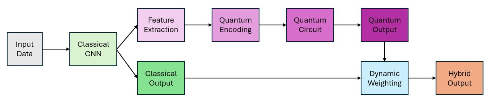

# QNN (v3.1.0) Implementation Documentation

## 1. Introduction
This documentation provides a comprehensive guide to our QNN (v3.1.0) implementation. Our hybrid quantum-classical neural network framework combines traditional convolutional neural networks (CNNs) with quantum circuits to create advanced hybrid models that can leverage quantum computational advantages while maintaining classical deep learning strengths.

Our implementation is specifically designed for data privacy applications, featuring quantum entanglement strategies, noise modeling, adversarial defense mechanisms, and feature encoding techniques.

## 2. Hybrid Quantum-Classical Approach
Our implementation uses a hybrid approach where:

- A classical CNN extracts features from input data
- These features are encoded into quantum states
- Quantum operations are applied to process information
- Quantum measurements generate outputs that are combined with classical outputs

## 3. Installation and Requirements
TBC

## 4. Implementation Architecture
Our QNN implementation follows a modular architecture with these major components:



### 4.2 Data Flow
1. **Input Processing**: Raw data is processed by a classical CNN
2. **Feature Extraction**: Intermediate features are extracted from CNN layers
3. **Feature Dimensionality Reduction**: FDR methods reduce feature dimensions
4. **Quantum Encoding**: Classical features are encoded into quantum states
5. **Quantum Processing**: Quantum circuit applies rotations and entanglement operations
6. **Quantum Measurement**: Quantum states are measured to produce probabilities
7. **Hybrid Combination**: Classical and quantum outputs are combined adaptively
8. **Output Generation**: Final classification output is produced

## 5. Key Components

### 5.1 FeatureExtractor Class
Purpose: Extracts intermediate features from  provided CNN model

```python
# Example usage
feature_extractor = FeatureExtractor(resnet_model, layer_name="layer3")
output = feature_extractor(input_data)
features = feature_extractor.get_features()
```

Key methods:
- `__init__(model, layer_name)`: Initializes extractor with specified layer
- `_register_hooks()`: Sets up hooks to capture intermediate features
- `get_features()`: Returns extracted features from  last forward pass

### 5.2 Entanglement Layer
Purpose: Applies different entanglement patterns to quantum qubits

```python
# Available entanglement types
entanglement_types = [
    'no_entanglement_ansatz',
    'linear_entanglement_ansatz',
    'full_entanglement_ansatz',
    'star_entanglement_ansatz'
]
```

Implemented patterns:
- **No entanglement**: Qubits operate independently
- **Linear entanglement**: Adjacent qubits are entangled (nearest-neighbor)
- **Full entanglement**: All-to-all qubit entanglement
- **Star entanglement**: Central qubit connected to all ors

### 5.3 DynamicWeightingModule
Purpose: Adaptively balances classical and quantum components

```python
# Example initialization
weighting_module = DynamicWeightingModule(input_dim=7, hidden_dim=128, num_layers=3)
alpha = weighting_module(classical_output, quantum_output)
```

Key features:
- Extracts statistical properties from both outputs
- Calculates dynamic weighting based on features like mean, variance, skewness, correlation
- Uses attention-like mechanism to focus on  most reliable component

### 5.4 Hybrid Forward Function
Purpose: Core function implementing hybrid quantum-classical processing

Key steps:
1. Processes input through classical CNN
2. Applies feature extraction and encoding
3. Executes quantum circuit with appropriate parameters
4. Applies adaptive weighting of outputs
5. Returns final hybrid result


## 6. Parameters and Configuration

| Parameter | Description | Type | Default | Range/Options |
|-----------|-------------|------|---------|---------------|
| cnn_model | Classical CNN model | nn.Module | Required | Any PyTorch model |
| device | Computation device | torch.device | Required | 'cuda' or 'cpu' |
| output_dim | Output dimension | int | 10 | ≥ 2 |
| circuit_depth | Quantum circuit depth | int | 2 | ≥ 1 |
| batch_size_limit | Max quantum batch size | int | 64 | ≥ 1 |
| param_mode | Parameter mode | str | 'vector' | 'scalar' or 'vector' |
| num_params | Number of parameters | int | 4 | ≥ 1 |
| noise_strength | Quantum noise strength | float | 0.05 | 0.0 to 1.0 |
| use_shots | Use shot-based sampling | bool | True | True/False |
| adversarial_defense | Enable adversarial defense | bool | True | True/False |
| feature_dim_reduction | Feature dimension after reduction | int | None | None or ≥ 1 |
| entanglement_type | Entanglement pattern | str | 'linear_entanglement_ansatz' | See section 8 |
| use_dynamic_weights | Enable dynamic weighting | bool | True | True/False |
| use_backprop | Use backpropagation | bool | True | True/False |
| encoding_method | Feature encoding method | str | 'enhanced_angle' | 'angle' or 'enhanced_angle' |
| noise_model | Quantum noise model | str | 'depolarizing' | See section 12 |
| feature_layer | CNN layer for feature extraction | str | None | Layer name or None |

## 7. Customizing the QNN Model
```python
# Create custom QNN model
custom_qnn = get_qnn_model(
    cnn_model=cnn_model,
    device=device,
    output_dim=10,                        # Number of classes
    circuit_depth=3,                      # Deeper quantum circuit
    batch_size_limit=32,                  # Memory-efficient batching
    param_mode='vector',                  # Use vector parameters
    num_params=8,                         # More trainable parameters
    noise_strength=0.1,                   # Increased noise for robustness
    use_shots=True,                       # Use shot-based sampling
    adversarial_defense=True,             # Enable defense mechanisms
    feature_dim_reduction=64,             # Reduce feature dimensions
    entanglement_type='full_entanglement_ansatz',  # Full entanglement
    use_dynamic_weights=True,             # Enable adaptive weighting
    use_backprop=False,                   # Use parameter-shift differentiation
    encoding_method='enhanced_angle',     # Enhanced encoding method
    noise_model='mixed'                   # Mixed noise model
)
```

## 8. Entanglement Approaches
### 8.1 No Entanglement Ansatz
Description: Qubits remain independent with no entanglement operations
Implementation:
```python
# No operations needed
pass
```

### 8.2 Linear Entanglement Ansatz
Description: Each qubit is entangled with its adjacent qubits
Implementation:
```python
for i in range(num_qubits - 1):
    qml.CNOT(wires=[i, i+1])
```

### 8.3 Full Entanglement Ansatz
Description: All-to-all connections between qubits
Implementation:
```python
for i in range(num_qubits):
    for j in range(i + 1, num_qubits):
        qml.CNOT(wires=[i, j])
```

### 8.4 Star Entanglement Ansatz
Description: One central qubit entangled with all others
Implementation:
```python
central_qubit = 0
for i in range(1, num_qubits):
    qml.CNOT(wires=[central_qubit, i])
```


## 9. Encoding Methods

Encoding classical data into quantum states is a crucial aspect of quantum machine learning. Our QNN implementation offers two encoding methods:

### 9.1 Standard Angle Encoding

**Method name: `angle`**

This method uses RY rotations to encode classical features into quantum states:

1. **Normalization**: Features are first normalized by subtracting mean and dividing by standard deviation
2. **Angle Mapping**: The normalized features are transformed to rotation angles within [-π, π] using the arctangent function
3. **Qubit Assignment**:
   - If features > qubits: Features are combined using weighted averages
   - If features < qubits: Features are duplicated across multiple qubits

### 9.2 Enhanced Angle Encoding

**Method name: `enhanced_angle`**

This method preserves more of the original data structure by using all three rotation gates (RX, RY, RZ) per qubit:

1. **Feature Preprocessing**:
   - Normalize features
   - Calculate features per qubit (3 features per qubit: one for each rotation)
   
2. **Dimension Handling**:
   - When features < needed: Create mapping matrix to expand dimensions
   - When features > needed:
     - Method 1: Select top features
     - Method 2: Use SVD for dimensionality reduction
     - Method 3: Fallback to strided selection if SVD fails
   
3. **Rotation Angle Generation**:
   - RX angles scaled to [-π, π] range
   - RY angles scaled to [-π, π] range
   - RZ angles scaled to [-2π, 2π] range


## 10. Training and Optimization

Our QNN model is designed to be trained using standard PyTorch optimization techniques:

### 10.1 Loss Functions

The hybrid model outputs log probabilities, making it compatible with standard classification loss functions:

```python
criterion = nn.CrossEntropyLoss()
```

### 10.4 Differentiation Methods

Our QNN supports two differentiation methods:

1. **Backpropagation** (`use_backprop=True`):
   - Incompatible with shots and noise models
   - Uses Pennylane's quantum gradient computation

2. **Parameter-shift** (`use_backprop=False`):
   - Compatible with all quantum features
   - Required for shot-based or noisy simulations

## 11. Quantum Circuit Design

### 11.1 Circuit Structure

The quantum circuit follows this general structure:

1. **Initial Encoding Layer**: Encode classical data into quantum states
2. **Repeated Variational Blocks** (controlled by `circuit_depth`):
   - Optional noise rotations (for robustness)
   - Entanglement layer (configurable pattern)
   - Parameterized rotation layer with trainable parameters
   - Re-application of data encoding with decay
   - Optional noise operations (physically realistic quantum noise)
3. **Measurement**: Calculate probabilities for all computational basis states

### 11.2 Parameter Design

Quantum parameters can be configured in two modes:

1. **Scalar Mode** (`param_mode='scalar'`):
   - Single trainable parameter for all qubits
   - More constrained model, fewer parameters

2. **Vector Mode** (`param_mode='vector'`):
   - Individual parameter for each qubit 
   - More expressive model, more parameters to train
   - `num_params` controls the vector size

## 12. Adversarial Defense Mechanism

Our QNN implements several adversarial defense capabilities:

### 12.1 Quantum Noise

Our QNN implementation provides four primary noise models, accessible through the `noise_model` parameter, to simulate realistic quantum conditions.

#### 12.1.1 Depolarizing Channel (`depolarizing`)
- General-purpose noise simulation
- Most realistic simulation of various error sources combined

#### 12.1.2 Amplitude Damping (`amplitude_damping`)
- Modeling energy loss in quantum systems

#### 12.1.3 Phase Damping (`phase_damping`)
- Modeling quantum decoherence

#### 12.1.4 Mixed Noise (`mixed`)
- Testing robustness against multiple error sources

### 12.2 Input Randomization (Optional)

To provide more robustness against adversarial attacks, our implementation includes sample-specific noise variation.

### 12.3 Output Smoothing (Optional)

### 12.4 Shots-Based Noise (Optional)

In addition to explicit noise models, the QNN can introduce sampling noise by using shot-based measurements:

```python
# Calculate the number of shots based on noise strength
# Higher noise strength = fewer shots (more sampling noise)
if use_shots:
    num_shots = max(100, int(1000 * (1.0 - noise_strength)))
else:
    num_shots = None
```

This simulates the statistical noise inherent in measurement-based quantum computing, with the number of shots inversely proportional to the desired noise level.
